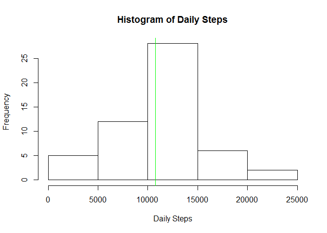
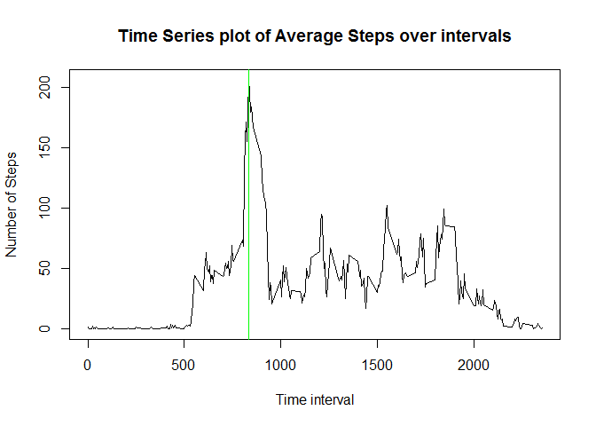
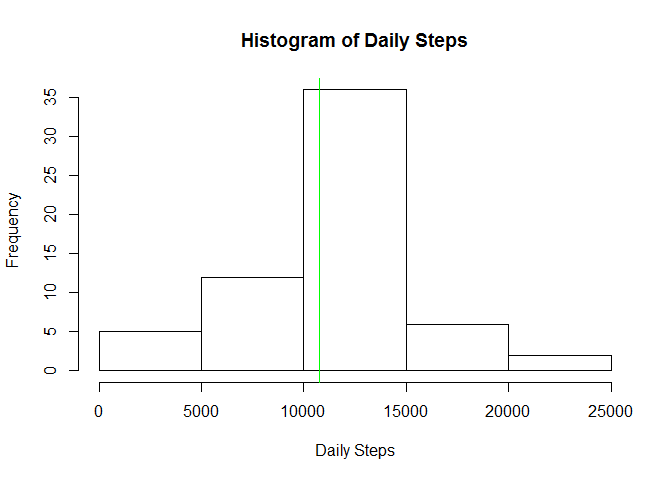
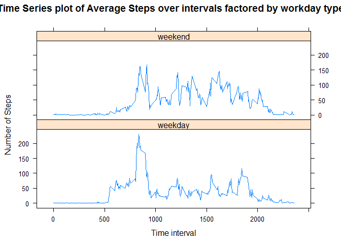

# Reproducible Research: Peer Assesment 1
cyanophyta  
August 18, 2017  


## Overview

This study is on Personal Activity data collected from monitoring devices attached to body of a volunteer. Data is collected for two months from the same volunteer, datapoints taken once every 5 minutes.  
Goal of this study is to compute summary statistics for the data and to identify various patterns in the data after necessary cleaning, basic processing and exploration.

## Loading and preprocessing data

We download the dataset from [Activity Monitoring Data link][1] and extract "activity.csv" from it. After loading the data in a data frame, we check dimension, data types of the data frame. We also check first few rows of data. 

[1]: https://d396qusza40orc.cloudfront.net/repdata%2Fdata%2Factivity.zip "Activity Monitoring Data link"


```r
library(knitr, warn.conflicts = FALSE, quietly = TRUE)
library(dplyr, warn.conflicts = FALSE, quietly = TRUE)
library(lattice, warn.conflicts = FALSE, quietly = TRUE)
df <- read.csv("activity.csv", na.strings = "NA")
dim(df)
```

```
## [1] 17568     3
```

```r
str(df)
```

```
## 'data.frame':	17568 obs. of  3 variables:
##  $ steps   : int  NA NA NA NA NA NA NA NA NA NA ...
##  $ date    : Factor w/ 61 levels "2012-10-01","2012-10-02",..: 1 1 1 1 1 1 1 1 1 1 ...
##  $ interval: int  0 5 10 15 20 25 30 35 40 45 ...
```

```r
head(df)
```

```
##   steps       date interval
## 1    NA 2012-10-01        0
## 2    NA 2012-10-01        5
## 3    NA 2012-10-01       10
## 4    NA 2012-10-01       15
## 5    NA 2012-10-01       20
## 6    NA 2012-10-01       25
```

## Exploring Total Daily Steps

We first plot a histogram of total daily steps and compute mean and median of this variable.


```r
stepsDTable <- df %>% group_by(date) %>% summarise(totalDailySteps = sum(steps))
meanDailySteps <- mean(stepsDTable$totalDailySteps, na.rm = TRUE)
medianDailySteps <- median(stepsDTable$totalDailySteps, na.rm = TRUE)
hist(stepsDTable$totalDailySteps, main = "Histogram of Daily Steps", 
     xlab = "Daily Steps")
abline(v = medianDailySteps, col = "green")
```

<!-- -->

Green vertical line shows the median of daily steps, which is 10765. Since mean of daily steps, which is 10766.19, is very close to the median, plot cannot distinctly show both due to long range of values of daily steps, which is [41, 21194].

## Average daily activity pattern

As data collection happens once every 5 minutes, there are (12 * 24 =) 288 entries for each day. We now consider average number of steps for each of these time periods, average taken over all days of data collection.


```r
stepsITable <- df %>% group_by(interval) %>% summarise(averageISteps = mean(steps, na.rm = TRUE))
maxISteps <- max(stepsITable$averageISteps)
modeISteps <- stepsITable[stepsITable$averageISteps == maxISteps, 1]
with(stepsITable, plot(interval, averageISteps, main = "Time Series plot of Average Steps over intervals", 
     xlab = "Time interval", ylab = "Number of Steps", type = "l"))
abline(v = modeISteps, col = "green")
```

<!-- -->

The green line on this time-series plot marks maximum average steps over intervals, and this maximum is attained at interval 835

## Handling Missing Values

This dataset has a number of rows containing missing values ('NA') in steps variable, as it was clear from the first few rows of the data frame. First, we compute the number of rows with missing values. Then we try to replace such missing values with average for the interval over all days. With this replacement done, we redraw histogram of Total Daily Steps and compute mean and median for it.


```r
missingSteps <- is.na(df$steps)
totalMissingSteps <- sum(missingSteps)
totalMissingSteps
```

```
## [1] 2304
```
There are a total of 2304 rows with NA values in 'steps' variable. We create a new data frame from the old one after replacing these missing values by average steps for that interval.


```r
newdf <- df %>% 
  mutate(steps = ifelse(is.na(steps), 
                        stepsITable$averageISteps[stepsITable$interval %in% interval], steps))
newStepsDTable <- newdf %>% group_by(date) %>% summarise(totalDailySteps = sum(steps))
newMeanDailySteps <- mean(newStepsDTable$totalDailySteps)
newMedianDailySteps <- median(newStepsDTable$totalDailySteps)
hist(newStepsDTable$totalDailySteps, main = "Histogram of Daily Steps", 
     xlab = "Daily Steps")
abline(v = newMedianDailySteps, col = "green")
```

<!-- -->

Green vertical line shows the median of daily steps, which is 10766.19. Since mean of daily steps, which is 10766.19, is same as the median, we didn't try to add a separate vertical line on mean. Just to get confirmation that this new data frame has no missing values in steps variable, we check on finding number of 'NA' in this column. 


```r
sum(is.na(newdf$steps))
```

```
## [1] 0
```

After this cleaning of missing values by interval-wise average steps, median value of total daily steps has become equal to mean now and mean hasn't changed. 

Earlier, missing values were missing for few days (eight days, to be precise), and so, on those days each interval had a missing value. Once we replaced these missing 'steps' values by interval-wise average, total steps for those days became equal to total of interval-wise average (over all the  intervals in a day), which is same as mean daily total. To summarize, by replacing missing values by interval-wise averages, we obtained replacement of missing total daily steps, and this replacement is same as average of total daily steps. So, mean hasn't changed after this cleaning exercise. Since, earlier median was less than mean and newly available values of total daily steps are same as mean, these new values brought median closer to mean. Incidentally, mean and median are now same after the cleaning exercise.

## Study of possible differences in data between weekdays and weekends

We'll use the cleaned dataset for checking if data patterns are different on weekdays as compared to patterns on weekends.


```r
newdf <- newdf %>% mutate(workday = as.factor(ifelse(weekdays(as.Date(date), abbreviate = TRUE) %in% c("Sat", "Sun"), "weekend", "weekday")))
newStepsITable <- newdf %>% group_by(interval, workday) %>% summarise(averageISteps = mean(steps))
newMaxISteps <- max(newStepsITable$averageISteps)
newModeISteps <- stepsITable[newStepsITable$averageISteps == maxISteps, 1]
with(newStepsITable, xyplot(averageISteps ~ interval|workday, main = "Time Series plot of Average Steps over intervals factored by workday type", 
     xlab = "Time interval", ylab = "Number of Steps", type = "l", layout = c(1, 2)))
```

<!-- -->

As these two timer-series plots demonstrate, there are some differences in daily activities between working days (weekdays) and weekends. During weekdays, number of steps are more during 05:00 and 09:00 hours, with peak number of steps are around 08:30; previous time-series plot without conditioning on weekdays, had shown this peak at 08:35. Approximately between 09:30 and 18:30, there are more activities (causing more steps measured) during weekend as compared to weekdays. That is expected as this time period is usual 'office working hours' on weekdays and usual 'daytime activity time' during weekends.

## Conclusion
We studied activity monitoring data collected over 2 months from a device attached to a person. After cleaning missing values by interval-specific average, we found that median of total daily steps has moved close to mean. We also observed that mode of number of steps over interval occurs at around 08:35 hours and that pattern of steps over time intervals are different between weekdays and weekends, during early morning hours and midday hours.
